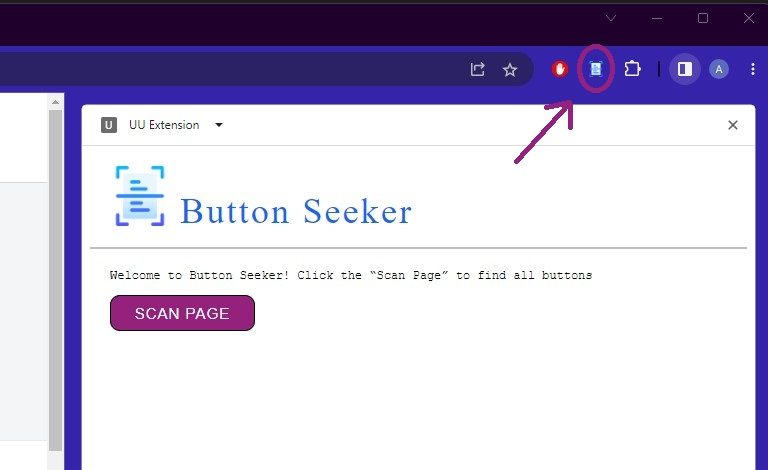
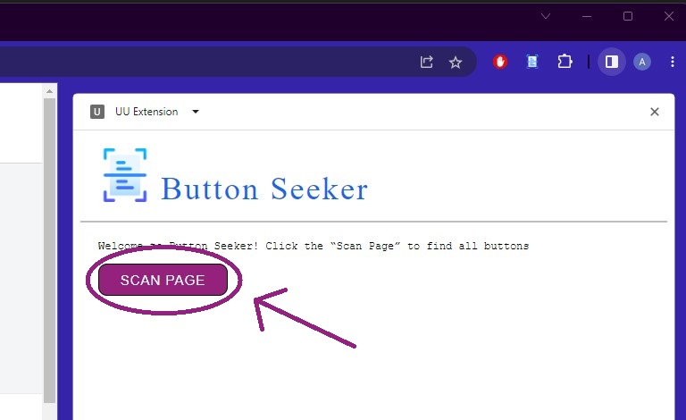
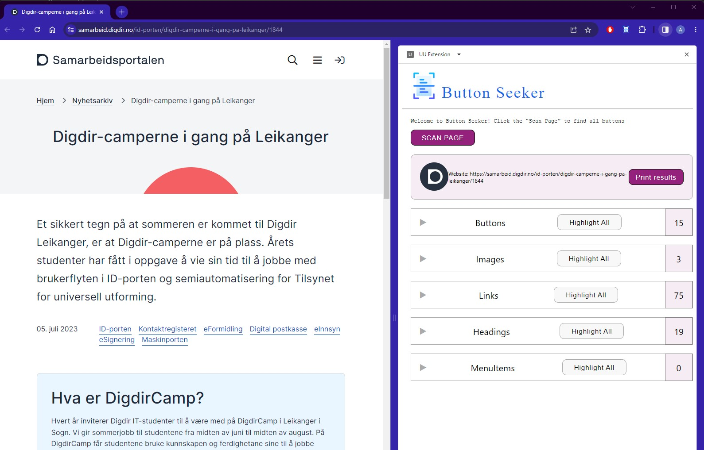
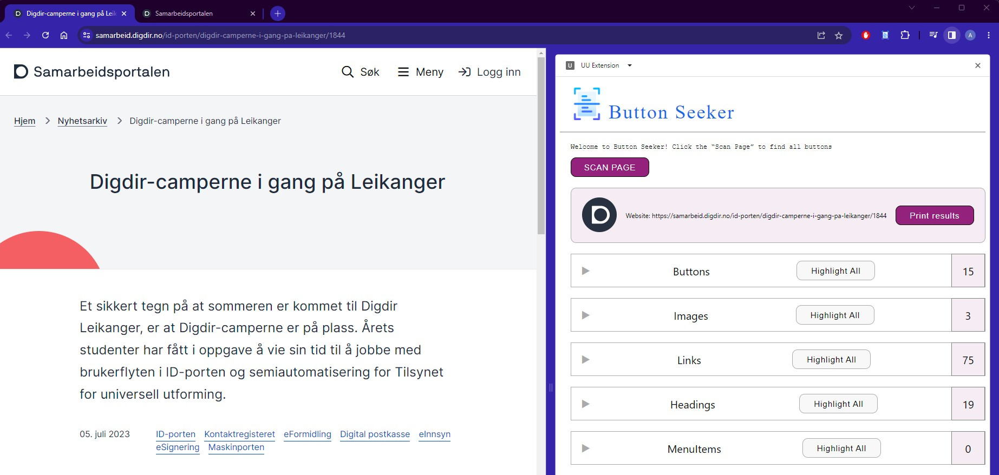
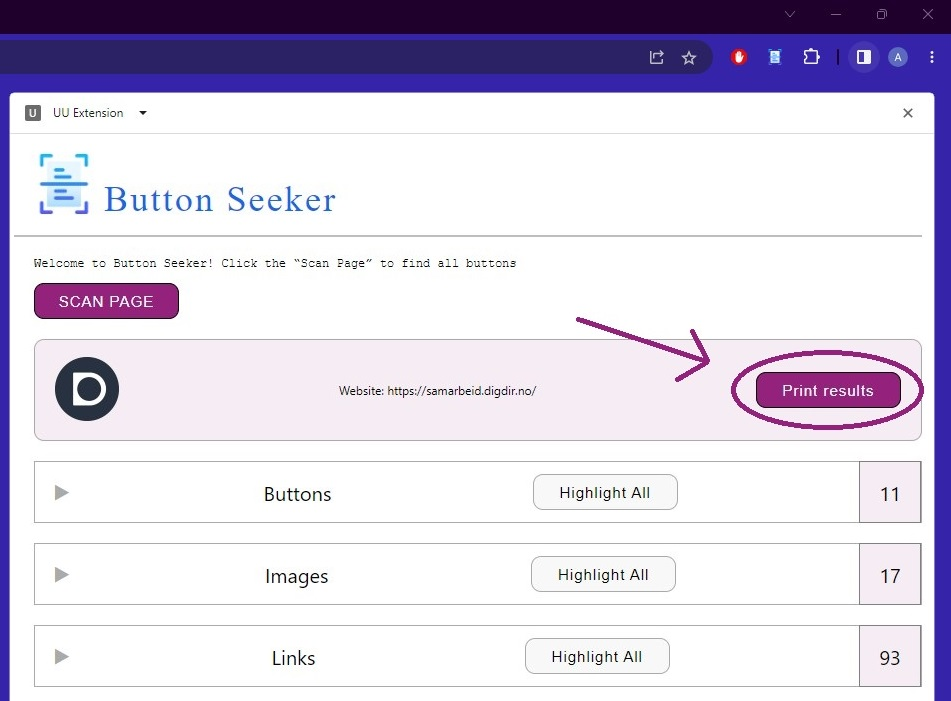

# Universal Design Analyzer Extension

## About

The Universal Design Analyzer Extension is a powerful tool designed to help developers analyze websites and test various properties against the Web Content Accessibility Guidelines (WCAG) requirements. It focuses on evaluating two crucial properties:

### Intuitive and User-Friendly Buttons
Developers can use this extension to assess whether buttons are designed in a way that makes them easy to understand and use for users. By verifying the intuitiveness of buttons, developers can enhance user experience and improve accessibility.

### Alternative Text for Non-Text Content
The extension allows developers to verify whether images and non-text items have appropriate alternative text. Providing accurate alternative text enables users with visual impairments to understand the meaning conveyed by these elements.

## Target audience
This extension is created for developers who wish to partially automate tests on their websites. It's specifically designed for developers who already have some experience in web development, including HTML, CSS, and JavaScript. Having prior knowledge of accessibility guidelines (such as WCAG) and a basic understanding of UX design principles is beneficial. Additionally, being proficient in using accessibility evaluation tools and staying updated with the latest industry trends can further enhance the advantages of using this extension. 
Knowledge of the various methods to code a button will also prove useful, as this extension aims to distinguish between well-designed buttons and poorly-designed ones.

## Setup

To set up the extension, follow these steps:

1. Open the root directory of the extension in a terminal.

2. Run the following commands in the terminal:


    ```npm install```

    ```npm run build```

    This will install the necessary dependencies and build the extension.

3. After the build process is complete, a new directory named 'dist' will be created.

4. Load the 'dist' directory into Chrome (chrome://extensions/) to use the extension.

## User Manual

1. Click on the UU Extension. A side panel titled "Button Seeker" will appear.



2. Click on "Scan Page". You will see a header displaying the logo and URL of the respective page. There are collapsible categories for Buttons, Images, Links, Headings, and MenuItems. Each category has a "Highlight All" button that you can click to highlight all elements belonging to that category. Clicking the "Highlight All" button again will remove the highlighting. The number of items in each category is also displayed.

<div width="660px" display="flex" flex-direction="row">
    
    
</div>

3. You can expand one or multiple categories to display all the elements within that category. The expandable items will have a corresponding "Jump to" button that highlights the element and scrolls to it. Clicking the "Jump to" button again will remove the highlighting. Additionally, you have the option to leave a comment related to the element.



4. If you expand an element, a table will appear showing the element's attributes and their associated values, along with the HTML for that element.


5. If you wish to inspect the data in another tab, you can click on "Print results".



## Troubleshooting

If you encounter any issues while using the Universal Design Analyzer Extension, please refer to the troubleshooting steps below:

1. Extension not loading or appearing in Chrome extensions:

* Ensure that the extension build process (npm run build) completed successfully without any errors.
* Double-check that the dist directory, containing the built extension files, exists in the root directory.
* Go to chrome://extensions/ in your Chrome browser and verify if the extension is listed. If it is, ensure that the "Developer mode" toggle is enabled.
* If the extension is not listed, try reloading the dist directory by clicking on the refresh button in the extensions page.
* If the issue persists, restart your Chrome browser and try loading the extension again.
* If the extension still does not appear, try loading the extension in a different browser or on a different computer to determine if the issue is specific to your browser or computer.

2. Button Seeker panel not displaying or functioning properly:

* Make sure you have clicked on the Universal Design Analyzer Extension icon to open the side panel titled "Button Seeker".
* If the side panel does not appear, try reloading the webpage or opening a different webpage to see if it appears there.
* If the side panel does not appear, try reloading the webpage or opening a different webpage to see if it appears there.
* Check for any error messages or warnings in the browser console (accessible via right-click -> Inspect -> Console) that may indicate issues with the extension's functionality.
* If there are console errors related to the extension, try clearing your browser cache and reloading the extension.

3. Incomplete or incorrect scan results:

* Verify that you have clicked on the "Scan Page" button in the Button Seeker panel.
* Ensure that the webpage you are testing has fully loaded before initiating the scan.
* Check for any error messages in the console that may indicate problems with fetching or processing the webpage elements.
* If the scan results seem incomplete or inaccurate, try refreshing the webpage and performing the scan again.
* If the issue persists, try scanning a different webpage to determine if it's specific to a particular website.

4. Issues with highlighting, jumping to elements, or leaving comments:

* Ensure that JavaScript is enabled in your browser and that no browser extensions or settings are blocking the functionality of the extension.
* Check if the highlighting, jumping, and commenting features work as expected on other websites to identify if the issue is site-specific.
* Try using the extension on different webpages to see if the problem persists.
* If the issue persists, consider updating your Chrome browser to the latest version or try using the extension on a different browser.

5. Extension not analyzing buttons or other elements correctly:

* Verify that you are using the latest version of the Universal Design Analyzer Extension. Check for any updates in the extension's repository.
* Review the extension's documentation and ensure that you are following the recommended guidelines for analyzing buttons and other elements.
* If you suspect a bug or incorrect behavior in the extension, consider reporting the issue at the extension's repository: https://github.com/ksvedal/uu-chrome-extension

## Extension Architecture


The extension architecture diagram depicts the arrangement of the extension. Each square represents a component and its associated methods, while the lines illustrate the collaboration between the components. The purple boxes signify the components that are visible to users.
Within the diagram, the sidebar component encompasses the resultheader, including a tabIcon and a collapsible item. The messageSender class facilitates communication between the sidebar and the contentScript, enabling user interaction with the web page. The interaction between cotentscript.tsx and sidebar.tsx occurs through callback functions.


## Conclusion 

The Universal Design Analyzer Extension is a powerful tool that simplifies the semi-automatic analysis of buttons and other crucial elements within HTML pages. With its intuitive interface and comprehensive functionality, this extension empowers developers to efficiently navigate through buttons and evaluate their properties.

By using the extension, developers can assess the intuitiveness and user-friendliness of buttons, ensuring an enhanced user experience. Additionally, they can verify whether images and non-text elements have appropriate alternative text, improving accessibility for users with visual impairments.

The extension's capabilities go beyond mere analysis. It allows developers to save evaluation results for future reference, streamlining the development and testing process. The ability to highlight and jump to specific elements within the page, along with leaving comments related to those elements, enhances collaboration and communication among team members.

By automating aspects of the analysis process, the Universal Design Analyzer Extension helps developers streamline their workflow, saving valuable time and effort. With its focus on adherence to accessibility guidelines and user-friendly design, this extension empowers developers to create inclusive and accessible web experiences.
