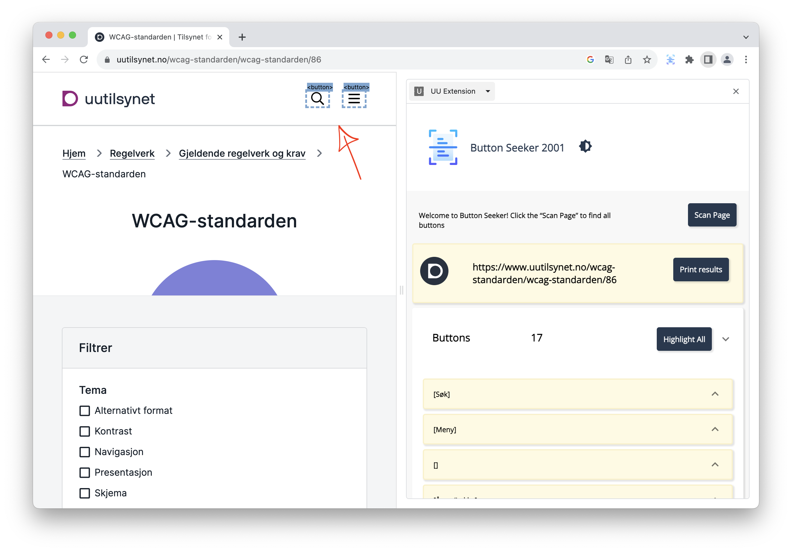
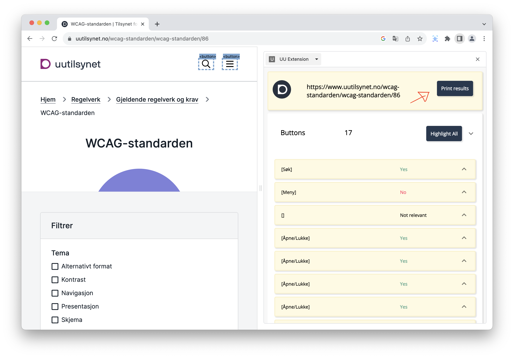

# Universal Design Analyzer Extension

## About

The Universal Design Analyzer Extension is a specialized tool that assists developers in analyzing websites to ensure adherence to the Web Content Accessibility Guidelines (WCAG). Primarily focused on two key areas—intuitive button design and the provision of alternative text for non-text content—this extension simplifies the semi-automatic evaluation of HTML elements. Developers can efficiently assess the user-friendliness of buttons and verify the alternative text for images, enhancing user experience and improving accessibility. Its capabilities extend beyond analysis by allowing the saving of evaluation results, highlighting specific elements on the page, and facilitating collaboration through comments. By automating aspects of the testing process, it streamlines the workflow, saving time and reinforcing the commitment to inclusive and accessible web design. Targeted at developers with experience in web development, accessibility guidelines, and UX design, this extension is a powerful ally in creating websites that are both intuitive and accessible.

## Table of Contents
   - [About](#about)
   - [Scripts and Dependencies](#scripts-and-dependencies)
        - [Main Dependencies](#main-dependencies)
        - [Development Dependencies](#development-dependencies)
        - [Scripts](#scripts)
   - [Setup](#setup)
   - [User Manual](#user-manual)
   - [Architecture and Structure](#architecture-and-structure)
        - [Architecture Diagram](#architecture-diagram)
        - [File Structure Tree](#file-structure-tree)
   - [Troubleshooting](#troubleshooting)
   - [Backend](#backend)
   - [Future work](#future-work)
   - [Contributors](#contributors)

## Scripts and dependencies

### Main Dependencies:
- **@emotion/styled**: `^11.11.0` - A library that allows you to style applications using tagged template literals.
- **@mui/icons-material**: `^5.14.1` & **@mui/material**: `^5.14.2` - Material-UI components and icons.
- **axios**: `^1.4.0` - Promise-based HTTP client.
- **chrome**: `^0.1.0` - Chrome integration.
- **find-chrome-version**: `^2.2.0` - Utility to find Chrome version.
- **pretty**: `^2.0.0` - Code formatting.
- **React & ReactDOM**: `^18.2.0` - The core libraries for building user interfaces.
- **React Router DOM**: `^6.14.0` - A collection of navigational components.
- **react-select**: `^5.7.3` - Select control for React.
- **react-syntax-highlighter**: `^15.5.0` - Syntax highlighting component.
- **react-toastify**: `^9.1.3` - React toast notifications.
- **uuid**: `^9.0.0` - Universal Unique Identifiers library.

### Development Dependencies:
- **Babel, TypeScript, Jest & related packages**: Various versions - For building and testing.
- **Webpack & related packages**: Various versions - For bundling.

### Scripts:
- **`watch`**: Runs the webpack in watch mode with development configuration.
- **`build`**: Builds the app for production using the webpack production configuration.
- **`clean`**: Removes the `dist` folder.
- **`test`**: Runs the Jest test suite.
- **`style`**: Formats the TypeScript files in the `src` directory using Prettier.


## Setup

To set up the extension, follow these steps:

1. Open the root directory of the extension in a terminal.

2. Run the following commands in the terminal:


    ```npm install```

    ```npm run build```

    This will install the necessary dependencies and build the extension.

3. After the build process is complete, a new directory named 'dist' will be created.

4. Load the 'dist' directory into Chrome (chrome://extensions/) to use the extension.

## User Manual

1. Click on the UU Extension. A side panel titled "Button Seeker" will appear.


2. Click on "Scan Page".  


3. You will now see a header displaying the logo and URL of the respective page.
There are collapsible categories for Buttons, Images, Links, Headings, and MenuItems. The total number of elements in within this category is also displayed.
Each category has a "Highlight All" button that you can click to highlight all elements belonging to that category with a distinct color. Clicking the "Highlight All" button again will remove the highlighting.


4. These categories can be clicked and expanded. This will reveal all elements of this category and also mark them on the site with their tag.



5. You can also expand each element, marking the single element on the site (1) and jump to it if possible. This will reveal a table (2) showing the elements attributes and associated values.
   You can then select between three different radio buttons (3) if the element label identifies its function, and complies with the standard.


6. Pressing one of these buttons expands a comment field (1) that also lets the user comment the reason for their choice or elaborate.
   The selected radio button value also gets displayed and color coded next to the element title (2).


7. If you wish to retrieve the site data along with your verdict and comments for each button, click on "Print results".



8. There is also a dark mode toggle next to the application title at the very top. The application automatically applies system theme settings when it is started.


## Architecture and structure

The extension architecture diagram depicts the arrangement of the extension. Each square represents a component and its associated methods, while the lines illustrate the collaboration between the components. The purple boxes signify the components that are visible to users.
Within the diagram, the sidebar component encompasses the resultheader, including a tabIcon and a collapsible item. The messageSender class facilitates communication between the sidebar and the contentScript, enabling user interaction with the web page. The interaction between contentscript.tsx and sidebar.tsx occurs through callback functions.

### Architecture diagram


### File structure tree
Including Source files, Test files, Component files.

Excluding Configuration files.


## Troubleshooting

If you encounter any issues while using the Universal Design Analyzer Extension, please refer to the troubleshooting steps below:

1. Extension not loading or appearing in Chrome extensions:

* Ensure that the extension build process (npm run build) completed successfully without any errors.
* Double-check that the dist directory, containing the built extension files, exists in the root directory.
* Go to chrome://extensions/ in your Chrome browser and verify if the extension is listed. If it is, ensure that the "Developer mode" toggle is enabled.
* If the extension is not listed, try reloading the dist directory by clicking on the refresh button in the extensions page.
* If the issue persists, restart your Chrome browser and try loading the extension again.
* If the extension still does not appear, try loading the extension in a different browser or on a different computer to determine if the issue is specific to your browser or computer.

2. Button Seeker panel not displaying or functioning properly:

* Make sure you have clicked on the Universal Design Analyzer Extension icon to open the side panel titled "Button Seeker".
* If the side panel does not appear, try reloading the webpage or opening a different webpage to see if it appears there.
* If the side panel does not appear, try reloading the webpage or opening a different webpage to see if it appears there.
* Check for any error messages or warnings in the browser console (accessible via right-click -> Inspect -> Console) that may indicate issues with the extension's functionality.
* If there are console errors related to the extension, try clearing your browser cache and reloading the extension.

3. Incomplete or incorrect scan results:

* Verify that you have clicked on the "Scan Page" button in the Button Seeker panel.
* Ensure that the webpage you are testing has fully loaded before initiating the scan.
* Check for any error messages in the console that may indicate problems with fetching or processing the webpage elements.
* If the scan results seem incomplete or inaccurate, try refreshing the webpage and performing the scan again.
* If the issue persists, try scanning a different webpage to determine if it's specific to a particular website.

4. Issues with highlighting, jumping to elements, or leaving comments:

* Ensure that JavaScript is enabled in your browser and that no browser extensions or settings are blocking the functionality of the extension.
* Check if the highlighting, jumping, and commenting features work as expected on other websites to identify if the issue is site-specific.
* Try using the extension on different webpages to see if the problem persists.
* If the issue persists, consider updating your Chrome browser to the latest version or try using the extension on a different browser.

5. Extension not analyzing buttons or other elements correctly:

* Verify that you are using the latest version of the Universal Design Analyzer Extension. Check for any updates in the extension's repository.
* Review the extension's documentation and ensure that you are following the recommended guidelines for analyzing buttons and other elements.
* If you suspect a bug or incorrect behavior in the extension, consider reporting the issue at the extension's repository: https://github.com/ksvedal/uu-chrome-extension

## Backend

It is also possible to connect a backend to this project if the user wishes to save their work automatically and/or more systematically.

Link to related backend:
https://github.com/theaueland/uu-extension-backend

### Documentation Summary of backend repository
(As of 02 Aug 2023)

This is a restful server processing incoming HTTP requests from the chrome extension. It is responsible for storing the results from a semi-automatic test completed in the extension, and sent to the backend as JSON data.

The extension can also use this backend to fetch the data which is being displayed in the extension's side panel to the user conducting the semi-automatic test. This functionality is not fully completed yet, but it is intended to replace our current approach where we are getting this data manually from the html data.

The backend is divided into the modules server and WCAG. WCAG is then divided into the modules accessibility and database, as shown in the figure.

#### Structure and architecture
  

#### The server

The server is currently only serving at localhost on port 8080, unless another port is specified as a process environment variable. The server is set up to process the following HTTP requests:
- **GET 127.0.0.1:8080/buttons**
    - Getting all test results for buttons
    - Not implemented yet, currently only replying with a message
- **POST 127.0.0.1:8080/storage/saveButtons**
    - Saving the test result in a database
    - The data should be sent in the request body as JSON data
    - The request handler for this request will validate the JSON data before trying to save the data
- **GET 127.0.0.1:8080/storage/deleteAllButtons**
    - Deleting all rows in the database table used for saving the test results for buttons
    - This should not be in the deployment of the application, but it has been useful while developing when there is no important data in the database that should not be deleted

#### WCAG

The module WCAG is responsible for everything related to the semi-automatic test happening in the backend. While the server module is responsible for handling all incoming requests, and sending a response back to the client. This module is responsible for all of the interaction with the database and getting the computed properties from the accessibility tree, by querying the DOM of a specific website. This functionality is being implemented in the accessibility module in the backend because it proved to be challenging to get it to work in the frontend.

## Future work
The application can always be improved, and in this section we provide a list of known limitations, bugs and suggested improvements:

### Known limitations
- The highlighter marks buttons that are hidden behind menues, but the user will not be able to see them         before they open the menu manually.
- Will not detect buttons that are created dynamically. User needs to scan again.
- **Hidden buttons**: Some buttons rent shown before something happens on the website, but will still get detected   by the extension.
- **Shadow-Root**: The tool currently cant find elements hidden under a shadow-root/Shadow DOM. Example:
  helsenorge.no; wont find the buttons in the header.
- **The element properties table and Computed properties**: Currently the table that shows element attributes is hardcoded to only look for aria-labelledby, aria-label, title, Description, Role, Focusable. The last three has never worked and we dont think the tool actually looks for the right values here. A (potentially) better solution would be to get information from what the browser calculates but that is harder than it sounds like.
  - In the development branch we tried using computed properties, but connecting the accessibility tree to the DOM tree was a challenge. We got closer to a solution but it is dependent on chrome functionality that does not yet exist and the solution does not work. We will leave the branch to linger if there is a need for inspiration but it is not recommended to 

### Bugs and warnings
- Three warnings upon building:
   - Asset exceeding size limit: vendor.js
   - Assets exceeding size limit: content_script, sidebar
   - Recommendation: Use lazy loading to improve performance
- Bug where if you open sidepanel and change tab, the sidepanel will persist on the new tab.
- User gets warning about backend/database when trying to print json data even if they do not intend to          use backend.

### Suggested improvements
- **Unit Tests** are only about 60% done. Suggestion to complete testing and maybe add integration test.
  - testUtils
  - TabIcon
  - contentScript
  - websiteScanner
  - fetchData
  - messageSender and message components
- The code has been cleaned and refactored a bit, but this is still something that can be improved a lot.
- Additional functionality!
  - 

## Contributors

Contributions to this project:

**Andreas Conradi Nitschke** - [andreascnits](https://github.com/andreascnits)

**Audun Kristian Oklevik** - [AudunKristian](https://github.com/AudunKristian)

**Brage Navarsete** - [BrageAsperandenNavarsete](https://github.com/BrageAsperandenNavarsete)

**Eiril Solveig Ugulen** - [Eiril](https://github.com/Eiril)

**Kae Saito** - [kaechin](https://github.com/kaechin)

**Kristian Birkeli** - [krigubir](https://github.com/krigubir)

**Kristoffer Svedal** - [ksvedal](https://github.com/ksvedal)

**Thea Ueland** - [theaueland](https://github.com/theaueland)
